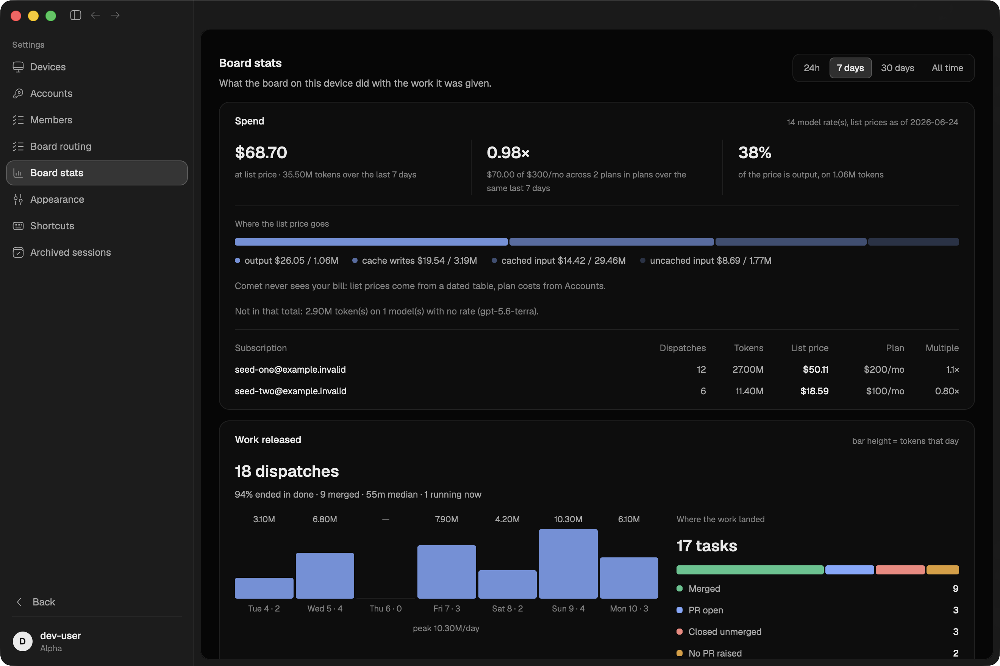
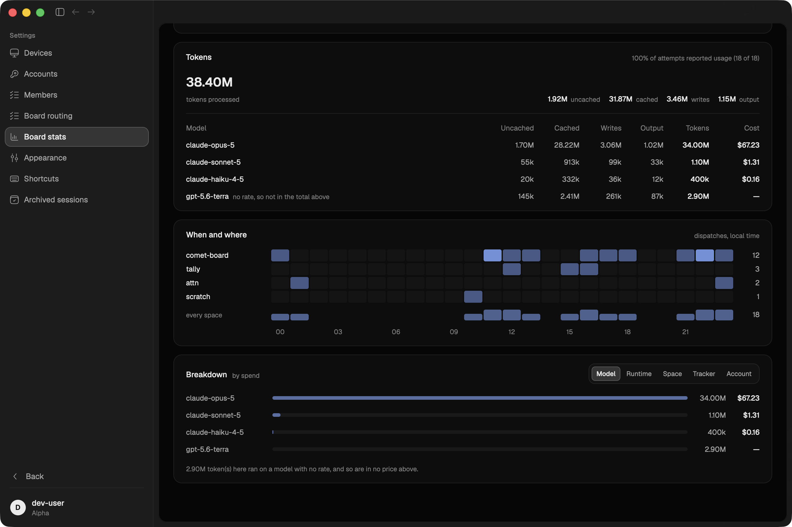
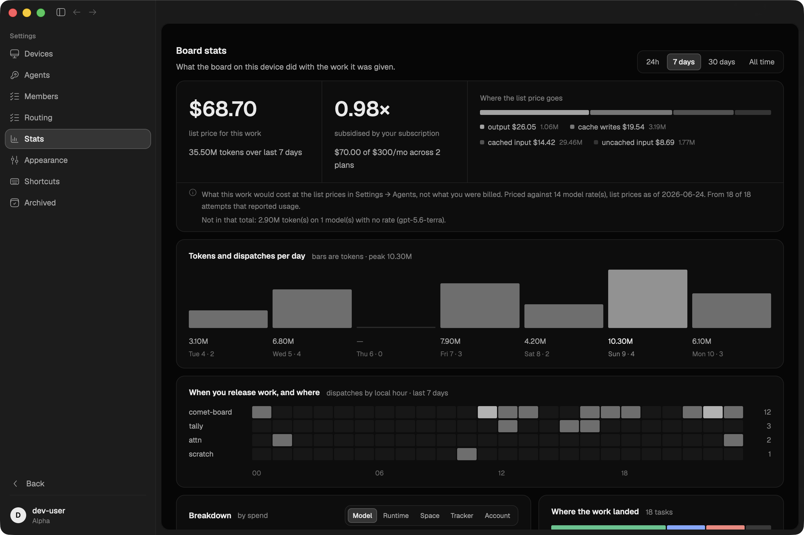
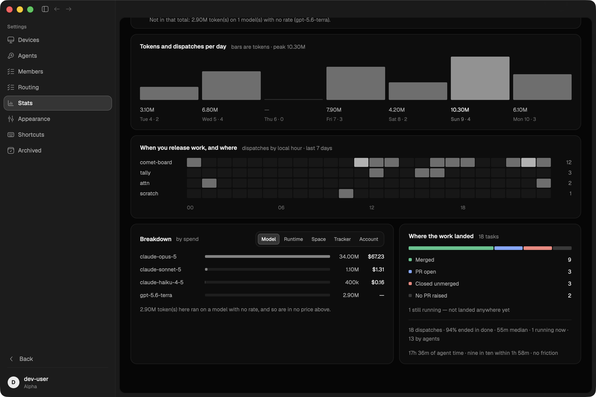
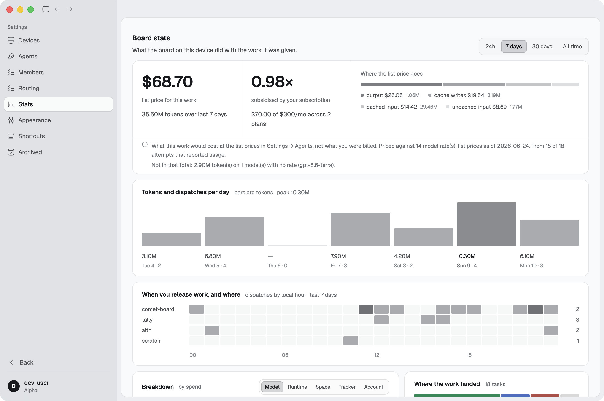
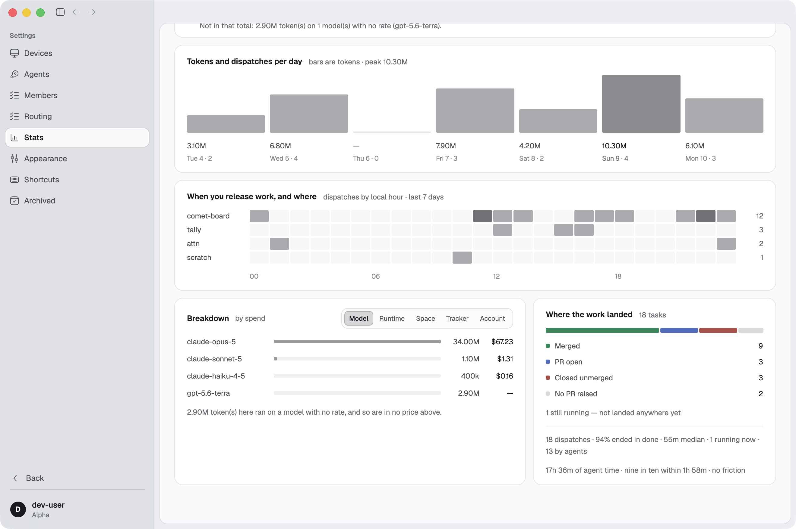
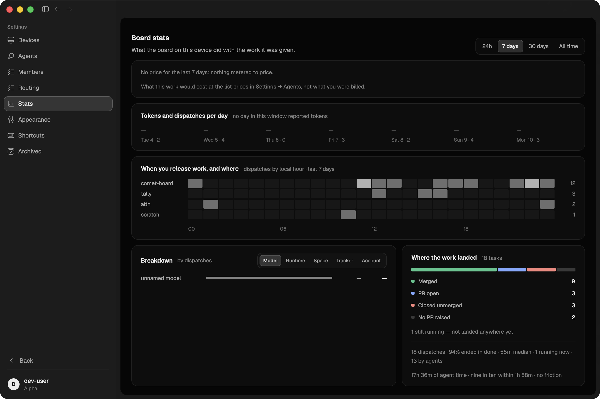

# gh#252 — the elements landed but the composition did not

Part of #171. gh#225–gh#228 each built their element correctly **into the old
container**, and nobody restructured the page. All four passed review, all four
were accurate about what they did, and none of them produced the page in
`Comet Stats Window.dc.html`.

This one was built from the design file itself — fetched over `DesignSync`
(project `c4110c0c-17f5-46e8-8cac-e6a7cb742175`) and read for its measurements,
not described. Every number in the constant block at the top of
`crates/ui/src/settings/stats.rs` comes off that file.

### Before and after, same board, same window

The screenshots below are the same seeded week rendered by the commit before
this branch and by its head, so the difference is the code and nothing else.
Reproduce either with `crates/board/examples/seed_stats.rs` — see
[Reproducing](#reproducing).

#### Before — two screens for one window

| | |
|---|---|
|  |  |

What the ticket was pointing at is all visible here: the nav says
`Accounts` / `Board routing` / `Board stats` / `Archived sessions`; `Work
released` is one card holding both the day chart *and* `Where the work landed`;
the outcomes bar sits in card two instead of last; the page ends in a stack; and
the bars are painted in the review hue, which on this page means a state.

#### After — dark

| | |
|---|---|
|  |  |

#### After — light

| | |
|---|---|
|  |  |

#### An empty chart collapses rather than reserves



Same eighteen dispatches, none of them metered. The day chart draws **no band at
all** — its aside says why and the captions still carry the dispatch counts —
and the whole page fits one 880px window. Before, this state was ~400px of
nothing holding seven em dashes.

### What changed

**Five cards in four rows, in the design's order.**

1. **Spend** — a three-cell band over a footer. No title: the figures are the
   page's headline, which is why they are at `TEXT_DISPLAY` (34px) rather than
   `TEXT_FIGURE`.
2. **Tokens and dispatches per day** — its own card, aside `bars are tokens ·
   peak 10.30M`, a 96px band, a quiet day as a 2px rule on the baseline.
3. **When you release work, and where** — the crossed grid.
4. **Breakdown** at `flex:3` — beside
5. **Where the work landed** at `flex:2`, `gap:12px`. The page ends in one
   two-column row.

**Every mark is ink, not accent.** A chart column, a heat cell, a meter fill and
a token-class chip are `Theme::white_alpha` — soft-white over dark, cool ink
over light — which is what the design's
`color-mix(in srgb, var(--text) N%, transparent)` means, and why the page
survives the theme flip without a second palette. The four status hues appear
once, in the outcomes bar, where they name states (gh#173).

Worth knowing if you touch this: the first version of that helper was
`theme.text.opacity(..)`, the same colour by a different route, and
`tests/text_tones.rs` rejected it — text paints in four named tones and nothing
between them (gh#172). Fills have their own primitive so the two cannot be
confused, and the rule caught the confusion on the first run.

**Short nav labels.** `Agents` / `Routing` / `Stats` / `Archived`. The page
headers are unchanged (`Board stats`, `Board routing`, `Archived sessions`) —
`SettingsSection::label` was only ever the sidebar's string, so the section name
no longer repeats the page title inside a 256px rail.

### What was removed, and where it went

The design has no room for a question answered twice, and three things on this
page were answered twice. None of the underlying numbers are gone — the board
still gathers them and `comet-board stats` still prints them.

| Removed | Where the same answer is now |
|---|---|
| The **Work released** card (headline, glance rows) | The day chart and the outcomes bar are cards 2 and 5. Duration, friction and who-dispatched are two caption lines under the outcomes they qualify. |
| The **Tokens** card (totals + per-model table) | Totals are the spend band's caption; the four classes are the split's legend with tokens on each; per-model is Breakdown → `Model`, one card lower and with money on every row. |
| The **per-subscription table** under the spend band | Breakdown → `Account` for tokens and cost; Settings → Agents for the plan. It cost the spend card ~300px to say a third thing a toggle away. |

**This is the one judgement call in the branch worth arguing with.** Deleting a
card is not something a layout ticket obviously licenses, and if the friction
counts or the per-account multiple should keep a card of their own, say so and
they come back — but they come back as a sixth card, and the page stops fitting
the window again.

### Reproducing

An empty board draws the empty state, which is the one state that cannot show
whether the layout is right. `crates/board/examples/seed_stats.rs` invents a
week — a quiet day mid-window, a peak day, all four landing categories including
both losses, two accounts, four models, evening-heavy hours in one space:

```sh
rm -rf /tmp/comet-stats
COMET_DATA_DIR=/tmp/comet-stats cargo run -p comet-board --example seed_stats

COMET_EDGE_URL=off COMET_DATA_DIR=/tmp/comet-stats COMET_IPC_PORT=27842 \
  COMET_HARNESS=mock COMET_OPEN_ROUTE=settings/stats COMET_THEME=dark \
  ./target/debug/comet
```

`SEED_NO_TOKENS=1` seeds the same week with nothing metered, for the collapsed
chart. `COMET_THEME=light` for the other half of the pair.

Two things the example refuses to do, both learned the hard way while producing
these screenshots: it will not run without `COMET_DATA_DIR` (unset, it resolves
to `~/.comet-native` — a real board — and silently inserts eighteen invented
tasks and overwrites `routing.toml`), and it will not write into a directory
that already holds a board. `COMET_IPC_PORT` matters too: without a distinct
port the app attaches to whatever engine is already running and reads *its*
board, which looks exactly like success.

### Notes

- Everything in the fixture is invented and marked as such — the accounts are
  `@example.invalid`, the tasks are `Seeded task N`. It is dispatch metadata and
  token counts, and it never leaves the data dir it is pointed at.
- Screenshots are committed on the branch and referenced by relative path, per
  `docs/agent-conventions.md`: a `raw.githubusercontent.com` link is unreadable
  on a private repo and names a branch that is deleted on merge.
