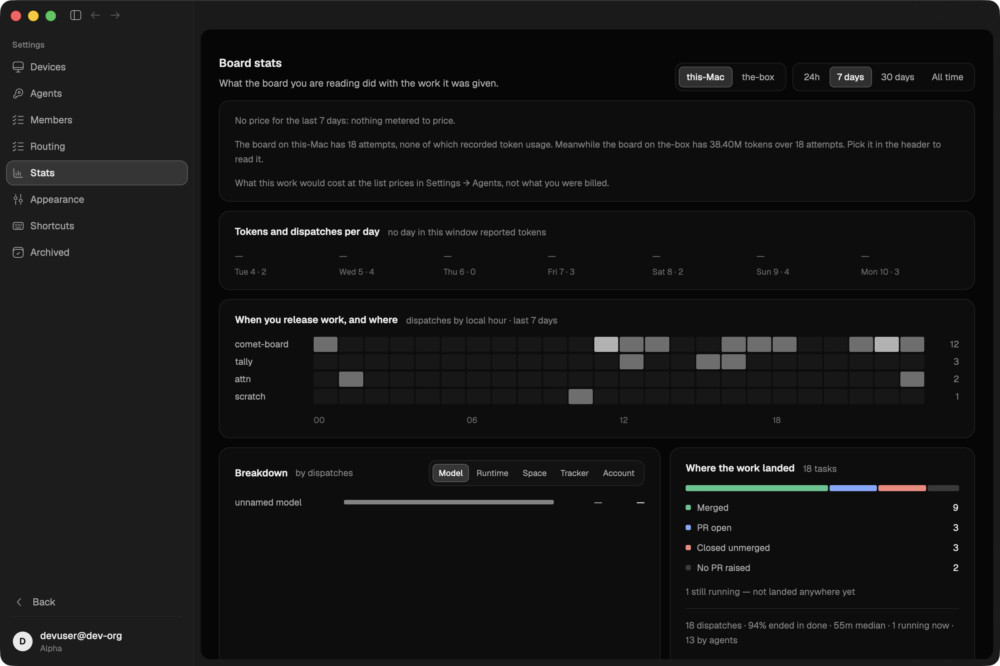
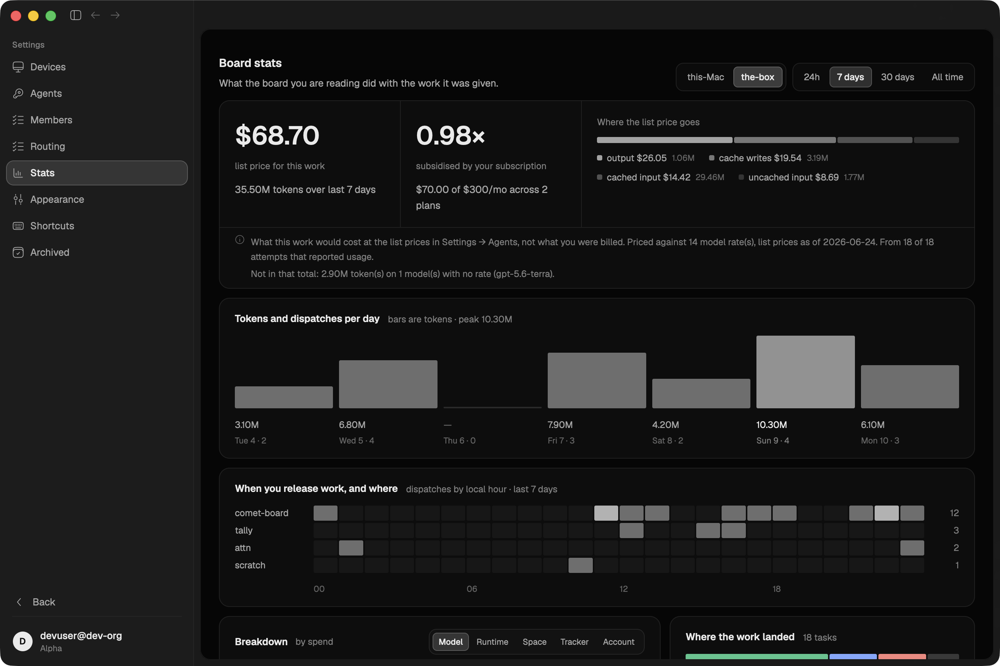
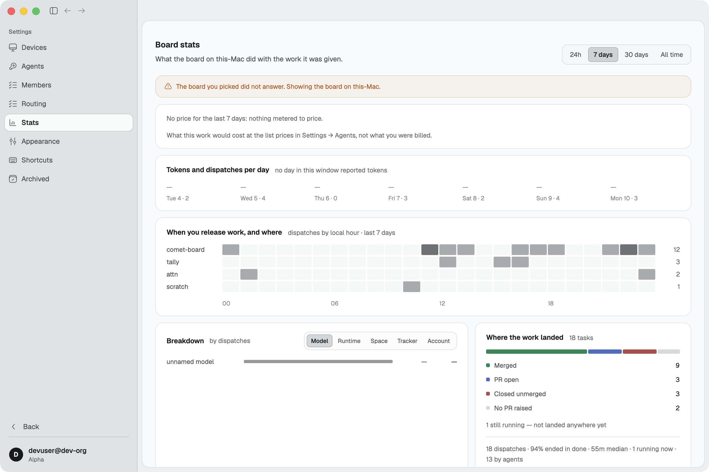

# gh#254 — the page picks a board for you, and picked the empty one

Part of #171, and the same fault §gh#195 calls "two boards and neither knew" —
reached by a settings page instead of by the doctor.

Settings → Board stats sweeps `view::board::host_candidates` for whichever
device answers `BoardStats`. With Comet running on the operator's Mac beside
the box there are two candidates, and the local one answers first, so the page
silently settled on it. Measured on that machine:

| board | attempts | reported usage | tokens |
|---|---|---|---|
| the Mac | 19 | **0** | 0 |
| the box | 12 | 6 | **46.1M** |

The Mac's attempts all predate token capture, and nothing new lands there
because dispatches on that machine go through the box. So the page's headline
figure — *what would this work cost at list price* — read
`No price for the last 7 days: nothing metered to price` permanently. The
pricing was fine. The page was showing the wrong board, and said nothing about
the other one it had just spoken to.

### What changed

**1. There is a way to say which board.** The sweep no longer stops at the
first answer: it asks every candidate and keeps them all. The boards it found
are a segmented control in the header beside the window picker — the same
control, because the question is the same kind of question — with the sweep's
own answer selected. Switching is a redraw, not a reload: the numbers for every
board that answered are already in hand.

The choice persists in `stats-prefs.json` beside `composer-defaults.json`. Its
own file rather than a field on `ui-settings.json`, which the shell saves
debounced from a copy it has held since boot — a settings page writing into
that would have its write undone by the next sidebar drag.

**2. An empty board says why it is empty.** `nothing metered to price` is true
and useless. `view::stats::other_boards_note` writes both halves — what this
board holds, and what the others do — so the reader can disbelieve the empty
state on evidence instead of on suspicion. The page could always see the other
candidates; it just never mentioned them.

**3. A pin that stops answering is said out loud.** The page falls back to the
sweep and names what it is showing instead of quietly becoming this bug again.

### Seen in the app

Two boards on one account: an engine on `the-box` holding the seeded week with
tokens, and the app itself on `this-Mac` holding the same week with nothing
metered — the state the page handled worst.

#### The resolved board is the empty one, and now it says so



The header carries `this-Mac | the-box`, the sweep's answer selected. Under the
spend line: *The board on this-Mac has 18 attempts, none of which recorded
token usage. Meanwhile the board on the-box has 38.40M tokens over 18 attempts.
Pick it in the header to read it.*

#### One click later



`$68.70` over 35.50M tokens — the figure the page could not show at all before.
Relaunching the app returns to this board: the pick is on disk.

#### The picked board stops answering



With the box's engine killed the page says so, falls back to the sweep, and
drops the control — one board is not a choice, so the subtitle names the host
again, as it always did.

### Reproducing

Two data dirs, one seeded with tokens and one without, on a dev edge so both
engines register as devices on one account:

```sh
cd edge && npx wrangler dev --port 8787 --var AUTH_MODE:dev &

COMET_DATA_DIR=/tmp/comet-box-data cargo run -p comet-board --example seed_stats
SEED_NO_TOKENS=1 COMET_DATA_DIR=/tmp/comet-mac-data \
  cargo run -p comet-board --example seed_stats

COMET_DATA_DIR=/tmp/comet-box-data COMET_IPC_PORT=27811 \
  COMET_EDGE_URL=http://localhost:8787 COMET_EDGE_TOKEN=devuser@dev-org \
  COMET_ORG_ID=dev-org COMET_HARNESS=mock COMET_DEVICE_NAME=the-box \
  ./target/debug/comet headless &

COMET_DATA_DIR=/tmp/comet-mac-data COMET_IPC_PORT=27851 \
  COMET_EDGE_URL=http://localhost:8787 COMET_EDGE_TOKEN=devuser@dev-org \
  COMET_ORG_ID=dev-org COMET_HARNESS=mock COMET_DEVICE_NAME=this-Mac \
  COMET_OPEN_ROUTE=settings/stats COMET_THEME=dark ./target/debug/comet
```

`COMET_IPC_PORT` is not optional on either: without it a dev instance attaches
to whatever engine is already running and reads *its* board, which looks exactly
like success.

### Where the rules live

`comet_proto::view::stats` — `HostBoard`, `HostBoard::emptiness`,
`other_boards_note` and `elsewhere_note`, beside every other derivation this
page and the CLI share. The pin and the resolution are the page's own
(`crates/ui/src/settings/stats.rs`): which board a *viewport* reads is not
something the box has an opinion about.
