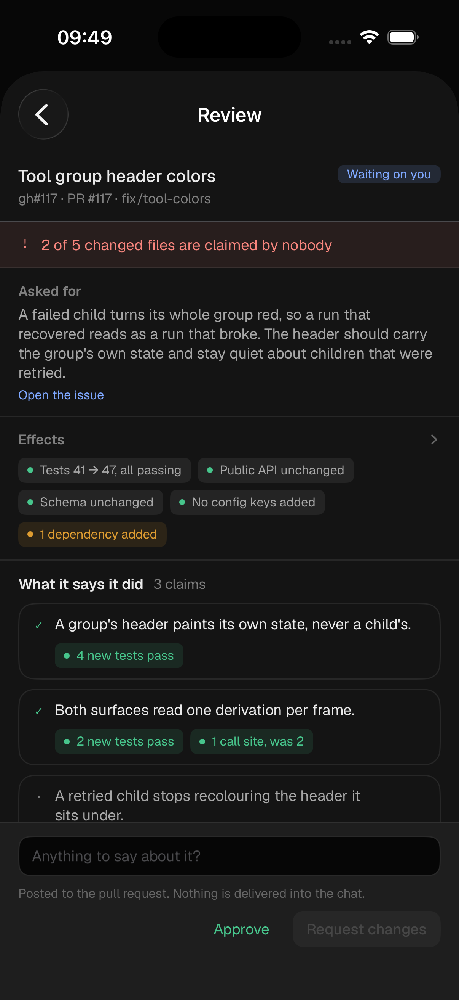
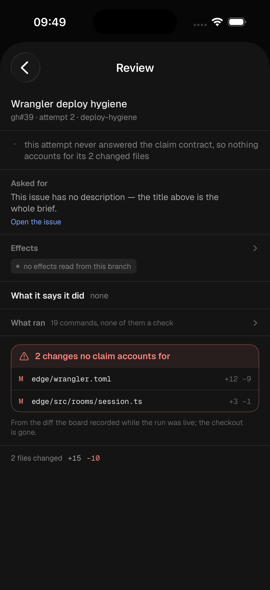

# The review screen on the phone — **done** (gh#256)

Follow-up to §gh#234. `BoardDetailSheet` is a generic task reader: it draws the
whole title, the issue body, the labels and the actions. That is what you *asked
for*, and until now the phone had nothing at all that said what came back — the
claims-and-effects review in `Comet iOS.dc.html` was the one screen in the
redesign with no counterpart in the app.

It is now `ReviewScreen`, pushed from the sheet, and it is the desktop's
`crates/ui/src/review.rs` in the phone's design language rather than a new
opinion about what a review is.

## Look at it first

Both at **393×852** (iPhone 16 Pro, iOS 26.4), demo dataset, no box.

| The state the design draws | The state it must not flatter |
| --- | --- |
|  |  |
| `-demo -route board -sheet review` | `-demo -route board -sheet review:gh:edge#39` |

The right-hand one is the point of the second demo payload. An attempt that
**never answered the claim contract** has no findings against it and has also
proved nothing; a screen that painted that green would be reporting an absence
of evidence as evidence of absence. It reads `unknown`, quietly — and the two
changes nobody claimed are still named, because they are still true.

## The order is the argument

Straight from `review.rs`, because the order is the whole design:

1. **The verdict strip**, in the ramp's blocked hue — the one hue this screen
   is allowed to shout in. Nothing else on the page may wear it. (The `−33` in
   the diff strip is the single carve-out: that hue belongs to the minus sign,
   and every other diff on earth paints it red.)
2. **The effects row before the claims** (§gh#236). A reader who has already
   been told a fluent story reads numbers underneath it as confirmation; the
   same numbers read *first* are what the story then has to agree with.
3. **The claims**, each carrying what the board found in the files that claim's
   own anchors reached. `✓` is reserved for a claim something the agent did not
   author stands behind; a claim nothing checks says `no test covers this` and
   drops to a dot.
4. **What nobody claimed**, which is the product.

## What the phone does differently, and why

- **The detail folds.** The desktop draws every claim's matched files and every
  effect's reason at once because it has a column to spend. Here the sections
  carry the answer and open on a tap to say where it came from — `Effects`
  expands into where each chip came from, `What ran` into the journal's check
  commands, a claim into its matched files and the anchors the diff never
  touched. Nothing that changes the reading is behind a fold: the glyph, the
  chips and the counts are always on screen.
- **No `Read the diff` chip.** The desktop's strip has one because
  `crate::changes` exists behind it. There is no diff viewer on the phone and
  there should not be — a 393pt column is the worst surface in the fleet for
  reading one. The counts are the fact; the pull request in the header is the
  way out. Drawing a dead chip would be a signpost to an empty room.
- **Two verdict buttons, not three.** The bar is `Approve` and `Request
  changes`, as the design file draws it. The desktop's third — a bare `Comment`
  — is a conversation, and the chat it belongs in is one tap away on the board.
  `Request changes` stays dark until the box has words in it, because GitHub
  refuses an empty `REQUEST_CHANGES` and is right to: a verdict with nothing in
  it tells the agent to change something unnamed.
- **The loudest finding is said once.** `render_remainder` repeats the verdict's
  own finding as a note under the block, which a wide card absorbs. In a phone
  column the repeat reads as a second, different problem, so the notes exclude
  whatever the strip is already leading with — and the empty-claims sentence
  goes quiet when the strip has already said those words.
- **The contract line sits above the buttons**, on its own row. Beside them,
  where the design draws it, it is the first thing a 393pt column truncates, and
  a promise that ends in an ellipsis is not one.

## Where it is reachable from

`boardReviewable(row)` — an attempt that has **ended**: `review`, `blocked`,
`failed` or `done`, with `attempts > 0`. A `working` row's agent has not
submitted its claims yet, so reviewing it would dress the unknown state up as a
finding about work still in progress.

It is deliberately **not** a `BoardRowAction`. Those are the shared rule
`row_actions` owns, ported from `comet_proto::view::board`; the review is a
*screen*, which is why the desktop reaches it through `shell::Route::Review` and
not through a chip. The phone's door is a row at the top of the detail sheet —
above the issue body, because the issue is what you asked for and this is the
only thing on the sheet that says what came back.

A row with no attempt still opens the screen and gets **"Nothing to review"** in
words. A blank claims list is a *claim* about the attempt; this is the absence
of one, and they must not look alike.

## The reading is ported, and pinned

`ReviewModels.swift` is a second implementation of `comet_board::claims` and
`comet_board::effects` — it has to be, no Rust runs on that device — and two
implementations of one rule is how a phone comes to disagree with a laptop about
whether an attempt is trustworthy. On the one screen whose whole job is to be
trusted about what a run did, that is the worst possible drift.

So the cases live outside both, exactly as §gh#157 did it for the stats page:

```sh
cargo test -p comet-board ios_review_spec               # the Rust half + the guard
UPDATE_REVIEW_SPEC=1 cargo test -p comet-board ios_review_spec   # regenerate
scripts/ios-review-spec.sh                              # the Swift half, in a simulator
```

`crates/board/tests/ios_review_spec.rs` builds eight reviews — the design's
screen, never-claimed, claimed-nothing, a malformed block, no diff at all, a
clean remainder that is still wrong, a branch nobody read, and one with a binary
file and uncountable call sites — asks the Rust for every verdict, finding,
effect chip, claim mark, claim chip, diff total and contract line, and writes the
lot to `apps/ios/Comet/Spec/review-spec.json`. `ReviewSpecRunner` (launch arg
`-review-spec`) asserts the Swift against the same file: **139 checks, no drift**.

The `AttemptReview` in each case is a real serialized one, so decoding it is half
the test — a key whose name skewed would otherwise reach the screen as a zero.
The demo payloads in `DemoDataset` are held as JSON and decoded for the same
reason.

**Only the cargo half runs in CI.** The Swift half needs a simulator, which is
the standing gap `apps/ios/README.md` describes: regenerating the fixture without
running `scripts/ios-review-spec.sh` turns the build green while leaving the
phone wrong about the rule that just changed. Nothing catches that but a person.

## Not touched

`Theme.swift`, `Comet.xcscheme`, `Info.plist`, and the forced dark scheme in
`CometApp` — light theme is its own ticket. `crates/ui/tests/ios_theme.rs` passes:
no literal radius or font size, no text tone multiplied by an alpha, and the one
`Circle()` (a chip's 5pt status dot) says what it is.
